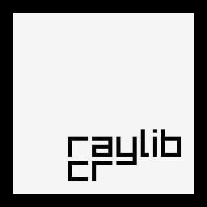

[](https://github.com/sol-vin/raylib-cr/actions/workflows/windows-build.yml)
[](https://github.com/sol-vin/raylib-cr/actions/workflows/ubuntu-build.yml)

# raylib-cr

Crystal Bindings for `raylib`, a small and easy to use game development library.  
As for now the bindings only support the raw function calls from raylib itself.
`raymath` functions are also supported, as are infix operators for vectors,
matricies, and quaternions.
# Supported platforms

These platforms are supported out of the box and are linked statically
1. 64-bit Linux
2. 64-bit Windows
3. Mac OS

Hopefully soon\
4. Raspberry PI

# Installation

### Linux
1. Run
```sh
sh rsrc/native/ubuntu/install.sh
```
2. Add `raylib-cr` to your `shard.yml`:
```yml
dependencies:
  raylib-cr:
    github: sol-vin/raylib-cr
```
3. Run `shards install`
4. Get programming!

### Windows

1. Follow the instructions at https://github.com/neatorobito/scoop-crystal to add the crystal-preview bucket to scoop
2. Install crystal with `scoop install crystal`
3. `powershell ./rsrc/native/windows/install.ps1`
4. Run in powershell
```powershell
$env:LIB="${env:LIB};C:\raylib"
$env:PATH="${env:PATH};C:\raylib"
```

OR

Run in cmd
```cmd
set PATH=%PATH%;C:\raylib
set LIB=%LIB%;C:\raylib
```
5. Add `raylib-cr` to your `shard.yml`:
```yml
dependencies:
  raylib-cr:
    github: sol-vin/raylib-cr
```
6. Run `shards install`
7. Get programming!

# Usage Example

`main.cr`

```crystal
require "raylib-cr"

Raylib.init_window(800, 450, "Hello World")
Raylib.set_target_fps(60)

until Raylib.close_window?
  Raylib.begin_drawing
  Raylib.clear_background(Raylib::RAYWHITE)
  
  Raylib.draw_text("Hello World!", 190, 200, 20, Raylib::BLACK)
  Raylib.end_drawing
end

Raylib.close_window
```
 1. Add `raylib-cr` to `shard.yml` dependencies.
 2. `shards install`
 3. Run in powershell (only needs to be run once per new console window opened)
```powershell
$env:LIB="${env:LIB};C:\raylib"
$env:PATH="${env:PATH};C:\raylib"
```
 4. `shards run`

# RayGUI, RLGL, Audio, and Lights
If you need to extra functionality, RLGL, RAudio and Lights can be included with the following.
```crystal
require "raylib-cr/raygui"
require "raylib-cr/rlgl"
require "raylib-cr/audio"
require "raylib-cr/lights"
```
# Contributing

1. Fork it (https://github.com/sol-vin/raylib-cr)
2. Create your feature branch (`git checkout -b my-new-feature`)
3. Commit your changes (`git commit -am 'Add some feature'`)
4. Push to the branch (`git push origin my-new-feature`)
5. Create a new Pull Request

# Owner
- [sol-vin](https://github.com/sol-vin)

# Major Contributors
- [rightbrace](https://github.com/b1tlet) - Raymath & Wrapper
- [D. Shwagginz](https://github.com/D-Shwagginz) - RayGUI
# Minor Contributors
- [b1tlet](https://github.com/b1tlet) - Fog Shader

# Inactive Contributors
- [AregevDev](https://github.com/AregevDev) - creator
